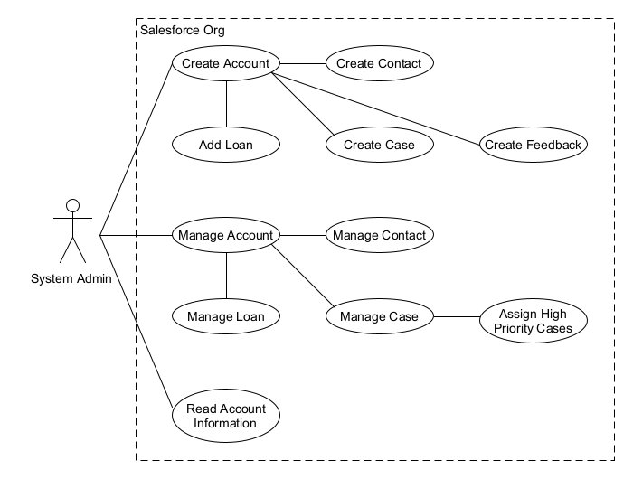
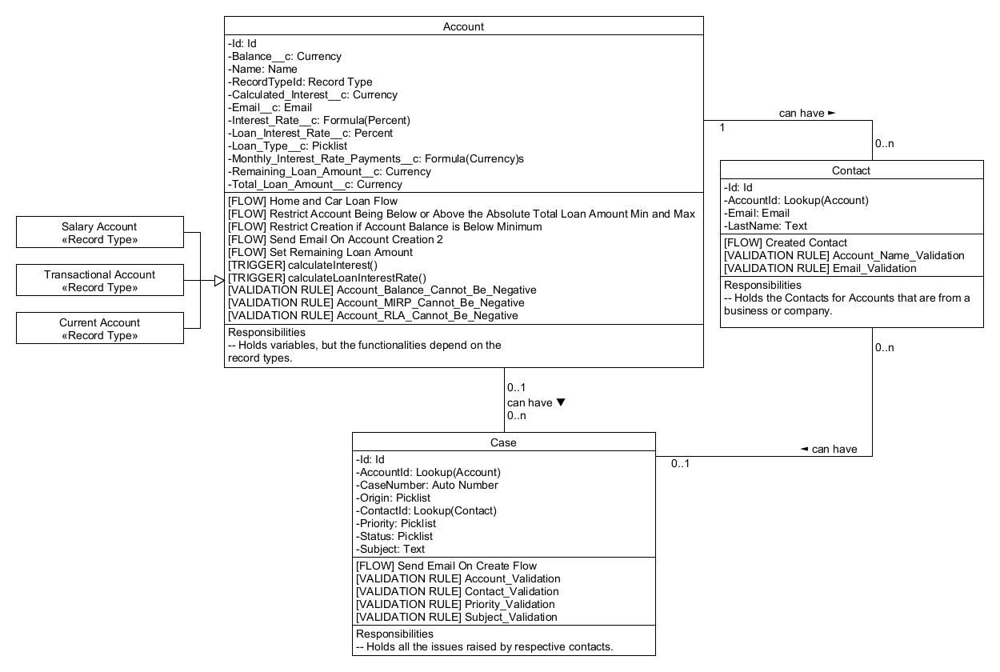

# Project | Enhance Banking and Loan Experiences

 

## Introduction

This application is applicable for creating 3 types of Bank Accounts in the system. These bank accounts will notify users for their FD renewal and interest rates. Also timely Loans related requirement mails should be triggering to the users.

To make it a seamless experience for the end users, we made a strong system which can take required information from users and can utilize it for the respective user's view and their growth in terms of profit for both bank and users.

 

## Design Diagrams

<!-- ## Submission

Once you finish the project, create a document having screenshots for all the requirements point by point and submit the same document on the provided URL.

**Note**: Upload document on Google Drive (or any other online platform that allows public sharing) and share public link to the document in the submission field in Student Portal. -->

 